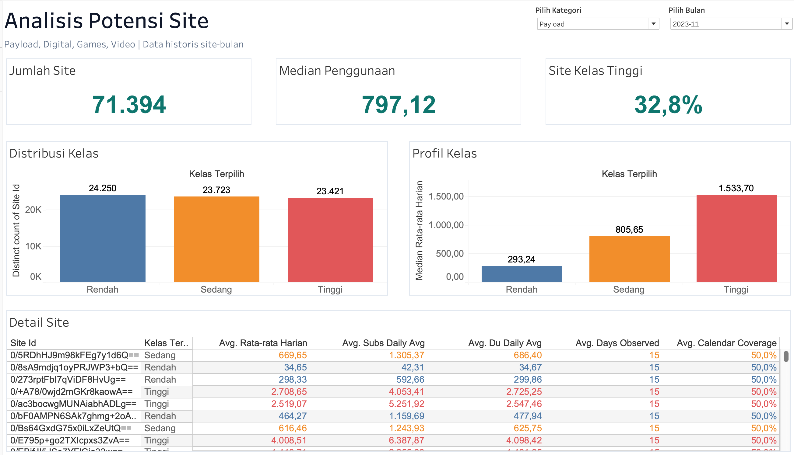
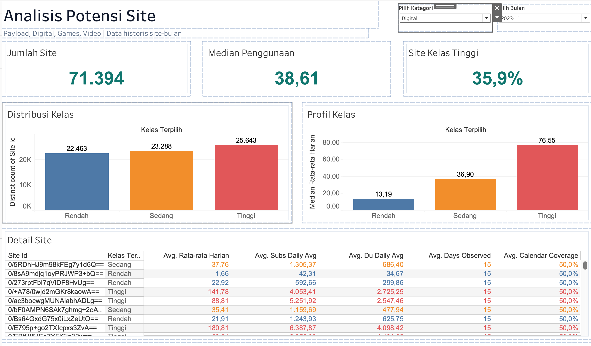
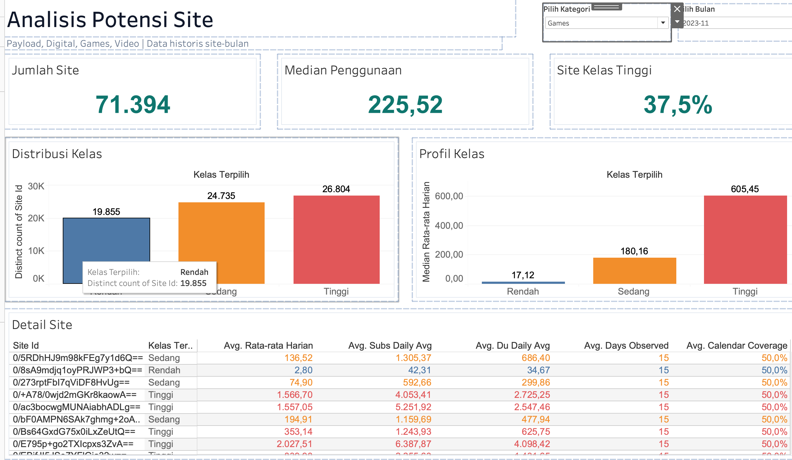
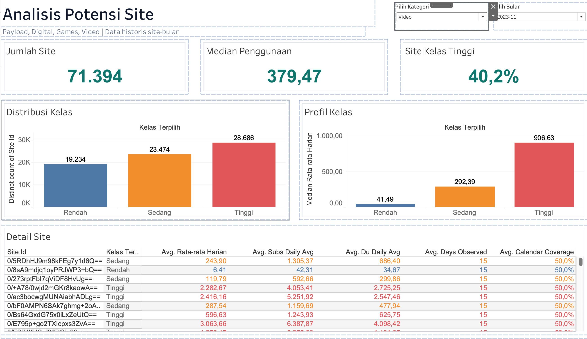

# Analisis Potensi Site Telkomsel

Dashboard Tableau dan notebook Python untuk membaca pola penggunaan historis site pada empat kategori: **Payload, Digital, Games, dan Video**. Setiap kategori membagi site ke kelas **Rendah, Sedang, dan Tinggi** berdasarkan rata-rata harian pada bulan tersebut.

Unit analisis adalah **satu site dalam satu bulan**, bukan pengguna individual. “Potensi” di proyek ini berarti posisi relatif metrik penggunaan historis. Kelas belum mengukur tambahan pendapatan, kualitas jaringan, atau permintaan yang belum terlayani.

**[Unduh dashboard lengkap (.twbx)](https://github.com/raka6march/analisis-potensi-site-telkomsel/releases/tag/dashboard-v1.0.0)** · [Notebook analisis](Insight_Potensi_Telkomsel.ipynb) · [Hasil validasi](docs/validation/dashboard_validation.json)



## Cara membuka dashboard

1. Buka halaman Release di atas dan unduh `Dashboard_Potensi_Site.twbx`. Unduhan mengikuti hak akses repository.
2. Buka paket tersebut di Tableau Desktop. Paket sudah berisi workbook, extract `.hyper`, dan CSV site-bulan sehingga sumber data tidak perlu diunduh terpisah. Workbook sumber disimpan menggunakan format Tableau 2024.3.
3. Buka tab **Dashboard Potensi Site**. Pilih **Pilih Bulan**, kemudian **Pilih Kategori**.
4. Baca tiga KPI, lanjutkan ke **Distribusi Kelas**, **Profil Kelas**, lalu **Detail Site**.
5. Klik batang pada **Distribusi Kelas** untuk memfilter detail site menurut kelas. Klik kembali atau bersihkan pilihan untuk menampilkan seluruh kelas. Aksi workbook ini menargetkan detail; KPI dan grafik profil tetap menjadi konteks seluruh site pada bulan terpilih.

Alternatif untuk pengembangan: ekstrak `.twbx` sebagai arsip ZIP, lalu letakkan folder `Data/` di samping [workbook `.twb`](tableau/Dashboard_Potensi_Site.twb). Koneksi workbook memakai path relatif `Data/kelas_site_bulanan.csv` dan `Data/Potensi_Site.hyper`. Jika Tableau meminta lokasi sumber, arahkan ke kedua file tersebut. Untuk perubahan CSV, refresh atau bangun ulang extract di Tableau agar data yang ditampilkan ikut berubah.

## Cakupan data dan metode kelas

Data dashboard memuat **652.500 baris site-bulan**, **74.313 site unik lintas periode**, dan **9 bulan**, dari November 2023 sampai Juli 2024. Jumlah site pada bulan tertentu dapat berbeda. Jangan menjumlahkan jumlah site antarbulan sebagai jumlah site unik keseluruhan.

Alur pengolahan pada notebook:

1. Validasi data site-hari dan agregasikan menjadi site-bulan.
2. Hitung rata-rata harian: **jumlah nilai metrik pada hari teramati ÷ jumlah hari site tercatat**. Hari tanpa data tidak otomatis dianggap nol.
3. Untuk setiap kategori, hitung persentil 33⅓% dan 66⅔% dari seluruh rata-rata harian site-bulan dalam periode historis. Setiap site-bulan memiliki bobot sama.
4. Tetapkan kelas dengan ambang yang sama untuk seluruh bulan dalam dataset tersebut.

| Kategori | Kolom nilai | Batas atas Rendah | Batas atas Sedang |
| --- | --- | ---: | ---: |
| Payload | `payload_user_daily_avg` | 569,67 | 1.098,20 |
| Digital | `digital_user_daily_avg` | 25,47 | 51,17 |
| Games | `games_user_daily_avg` | 61,98 | 346,89 |
| Video | `video_user_daily_avg` | 119,41 | 518,11 |

**Rendah:** nilai ≤ batas pertama. **Sedang:** batas pertama < nilai ≤ batas kedua. **Tinggi:** nilai > batas kedua. Angka tabel dibulatkan untuk dibaca; klasifikasi menggunakan presisi penuh dalam [hasil validasi](docs/validation/dashboard_validation.json).

Kelas sekitar sepertiga pada seluruh periode merupakan konsekuensi metode tertil. Dalam satu bulan, proporsinya dapat berbeda karena ambang tidak dihitung ulang per bulan. Ambang akan berubah jika notebook dijalankan ulang dengan periode sumber yang berbeda. Tableau membaca label `*_kelas` dari CSV; mengganti pilihan kategori atau bulan tidak menghitung ulang tertil.

**Satuan metrik dan definisi bisnis `subs`, `sdn`, `rgb`, `du`, serta empat metrik `*_user` belum dikonfirmasi melalui kamus data.** Karena itu, angka tidak diberi satuan GB, orang unik, atau rupiah. Kategori mungkin tumpang tindih dan tidak boleh dijumlahkan menjadi total pelanggan. Segmentasi ini deskriptif, tanpa model prediksi atau klaim akurasi machine learning.

## Cara membaca setiap bagian

| Bagian dashboard | Yang dihitung | Cara menafsirkan |
| --- | --- | --- |
| **Jumlah Site** | `COUNTD(site_id)` setelah memilih bulan | Banyaknya site berbeda yang tersedia pada bulan itu. November 2023 berisi 71.394 site. |
| **Median Penggunaan** | Median rata-rata harian kategori terpilih, lintas site pada bulan tersebut | Titik tengah distribusi penggunaan site. Bukan total bulanan dan bukan rata-rata seluruh site. |
| **Site Kelas Tinggi** | Site unik berkelas Tinggi ÷ seluruh site unik pada bulan terpilih | Persentase site yang melewati batas atas Sedang kategori itu. Bukan pangsa traffic, pelanggan, atau pendapatan. |
| **Distribusi Kelas** | Jumlah site unik pada tiap kelas | Menjawab “berapa banyak site di setiap kelas?”. Pada screenshot: biru = Rendah, oranye = Sedang, merah = Tinggi. Merah di sini adalah kelas, bukan alarm gangguan. |
| **Profil Kelas** | Median rata-rata harian di dalam masing-masing kelas | Menjawab “seberapa besar nilai penggunaan tipikal di kelas itu?”. Tinggi batang tidak menunjukkan banyaknya site. |
| **Detail Site** | Site, kelas kategori terpilih, rata-rata harian, metrik pendukung, dan cakupan hari | Digunakan untuk meninjau kandidat site setelah memahami ringkasan. |

Median 797,12 pada Payload, misalnya, berarti titik tengah rata-rata harian seluruh site pada bulan terpilih berada di sekitar 797,12. Median kelas Tinggi 1.533,70 hanya merangkum anggota kelas Tinggi. Median keseluruhan **tidak dapat dihitung dengan merata-ratakan tiga median kelas**.

### Kolom Detail Site

- **Site Id:** identitas site pada sumber. Tampilan yang tersandi tidak membuktikan anonimisasi penuh.
- **Kelas Terpilih:** label `payload_kelas`, `digital_kelas`, `games_kelas`, atau `video_kelas` sesuai parameter kategori.
- **Avg. Rata-rata Harian:** nilai `*_user_daily_avg` kategori terpilih. Karena data unik per site-bulan, agregasi `AVG` pada baris tersebut menampilkan nilai site-bulan itu.
- **Avg. Subs Daily Avg / Avg. Du Daily Avg:** rata-rata harian metrik pendukung `subs` dan `du`; definisi bisnisnya mengikuti kamus data yang masih perlu dikonfirmasi. Kedua kolom tidak berubah hanya karena kategori berganti.
- **Avg. Days Observed:** jumlah hari site tercatat pada bulan terpilih.
- **Avg. Calendar Coverage:** hari site tercatat ÷ jumlah hari kalender bulan tersebut. Contoh: 15/30 = 50,0% pada November.

CSV juga menyimpan `site_coverage_available`: hari site tercatat ÷ jumlah tanggal yang tersedia dalam file pada bulan itu. Nilai 100% pada ukuran ini masih dapat bersamaan dengan cakupan kalender 50%. Site hadir pada semua tanggal yang tersedia, tetapi file tidak mencakup seluruh bulan.

## Contoh pembacaan empat kategori: November 2023

Semua contoh berikut menggunakan bulan **2023-11** dengan **71.394 site**. Angka telah dicocokkan dengan CSV dan empat screenshot. Format angka Indonesia: titik untuk ribuan dan koma untuk desimal.

| Kategori | Median penggunaan | Site Rendah | Site Sedang | Site Tinggi | Persentase Tinggi |
| --- | ---: | ---: | ---: | ---: | ---: |
| Payload | 797,12 | 24.250 | 23.723 | 23.421 | 32,8% |
| Digital | 38,61 | 22.463 | 23.288 | 25.643 | 35,9% |
| Games | 225,52 | 19.855 | 24.735 | 26.804 | 37,5% |
| Video | 379,47 | 19.234 | 23.474 | 28.686 | 40,2% |

### 1. Payload

**Cara membaca:** distribusi kelas cukup berimbang. Ada 23.421 site kelas Tinggi, atau 32,8% dari seluruh site bulan November. Median rata-rata harian kelas Rendah, Sedang, dan Tinggi masing-masing **293,24; 805,65; dan 1.533,70**.

**Analisis:** median kelas Tinggi sekitar **5,23 kali** median kelas Rendah. Ini menunjukkan perbedaan besaran penggunaan dalam kategori Payload. Pemisahan tersebut memang diharapkan karena kelas dibentuk menggunakan metrik yang sama; rasio ini bukan bukti keberhasilan kampanye.

**Tindak lanjut yang dapat diuji:** tinjau kualitas layanan dan utilisasi kapasitas pada site Tinggi. Pada site Sedang, cari kenaikan yang konsisten antarbulan sebelum menguji penawaran paket data. Pada site Rendah, periksa ukuran basis site, cakupan observasi, dan hambatan penggunaan. Kelas saja belum cukup untuk menyimpulkan kebutuhan penambahan kapasitas.

### 2. Digital



**Cara membaca:** 25.643 site berada di kelas Tinggi (**35,9%**), dengan median penggunaan seluruh site **38,61**. Median kelas Rendah, Sedang, dan Tinggi adalah **13,19; 36,90; dan 76,55**.

**Analisis:** kelas Tinggi merupakan kelompok terbesar, tetapi bukan mayoritas karena proporsinya di bawah 50%. Median kelas Tinggi sekitar **5,80 kali** kelas Rendah. Site dengan Payload besar belum tentu memiliki Digital besar; pindahkan parameter kategori sambil meninjau site yang sama untuk melihat perbedaan profilnya.

**Tindak lanjut yang dapat diuji:** setelah definisi Digital dikonfirmasi, site dengan Payload tinggi tetapi Digital rendah dapat ditinjau sebagai kandidat uji adopsi layanan digital. Perbedaan kelas merupakan petunjuk awal, belum membuktikan pengguna belum mengadopsi layanan. Gunakan kelompok pembanding untuk mengukur dampak kampanye.

### 3. Games



**Cara membaca:** terdapat 26.804 site kelas Tinggi (**37,5%**). Median seluruh site **225,52**, sedangkan median kelas Rendah, Sedang, dan Tinggi adalah **17,12; 180,16; dan 605,45**.

**Analisis:** median kelas Tinggi sekitar **35,37 kali** kelas Rendah. Rentang profil antarkelas lebar, tetapi ini tidak berarti jumlah gamer, pendapatan, atau kebutuhan kapasitas berbeda sebesar rasio tersebut. Kelas Tinggi masih kurang dari separuh populasi site.

**Tindak lanjut yang dapat diuji:** periksa latensi, kehilangan paket, dan kualitas pengalaman pada kandidat site Tinggi sebelum merancang uji penawaran gaming. Tinjau kesinambungan pencatatan sebelum menyimpulkan bahwa Games rendah berarti minat rendah. Untuk Juni–Juli 2024, validasi perubahan data sejak 28 Juni terlebih dahulu; ambang global juga memasukkan periode tersebut sehingga label November ikut bergantung pada seluruh periode historis.

### 4. Video



**Cara membaca:** 28.686 site berkelas Tinggi (**40,2%**), paling besar proporsinya dibandingkan tiga kategori lain pada bulan ini. Median seluruh site **379,47**. Median kelas Rendah, Sedang, dan Tinggi adalah **41,49; 292,39; dan 906,63**.

**Analisis:** median kelas Tinggi sekitar **21,85 kali** kelas Rendah. Proporsi 40,2% menunjukkan lebih banyak site melewati ambang historis kategori Video. Angka ini bukan pangsa traffic video terhadap seluruh traffic dan belum membuktikan Video memiliki peluang bisnis terbesar, karena ambang dan definisi tiap kategori berbeda.

**Tindak lanjut yang dapat diuji:** lengkapi kandidat site Tinggi dengan informasi buffering, throughput, dan utilisasi jam sibuk untuk menilai pengalaman streaming. Site Sedang dapat menjadi kandidat eksperimen paket video. Seperti Games, periksa perubahan data akhir Juni sebelum menafsirkan perubahan antarbulan sebagai pertumbuhan atau penurunan penggunaan.

## Langkah analisis yang disarankan

1. **Tetapkan pertanyaan dan bulan.** Contoh: “Site mana yang layak ditinjau untuk eksperimen layanan Digital pada November 2023?”
2. **Periksa cakupan.** Bandingkan jumlah site, hari pengamatan, dan cakupan kalender. Pada November, hari pengamatan berkisar 1–15 per site, sehingga cakupan maksimal hanya 50%. Rata-rata dari sedikit hari dapat kurang mewakili sebulan penuh.
3. **Baca skala dan komposisi.** Gunakan median untuk nilai tipikal, distribusi untuk jumlah site, dan profil untuk perbedaan nilai antarkelas.
4. **Tinjau site tertentu.** Klik kelas, lalu lihat nilai dan cakupan di tabel. Contoh pada screenshot: site pertama bernilai Payload 669,65 dan Digital 37,76, keduanya kelas Sedang; Games 136,62 dan Video 243,90 juga Sedang. Angka lintas kategori memakai ambang masing-masing.
5. **Bandingkan kategori dan waktu.** Site yang sama bisa mempunyai kelas berbeda per kategori atau berpindah kelas antarbulan. Untuk analisis tren yang lebih kuat, bandingkan kelompok site yang sama dengan cakupan hari sebanding; perubahan populasi site dapat menggeser median agregat.
6. **Susun hipotesis dan ukur hasil.** Lengkapi kandidat dengan kualitas jaringan, lokasi, utilisasi, serta metrik bisnis yang relevan. Uji intervensi dengan periode dan kelompok pembanding yang jelas.

Contoh narasi laporan:

> Pada November 2023, kategori Video mencakup 71.394 site dengan median rata-rata harian 379,47. Sebanyak 28.686 site (40,2%) berada di kelas Tinggi berdasarkan ambang historis tetap. Median kelas Tinggi sebesar 906,63 menunjukkan nilai penggunaan tipikal yang lebih besar pada kelompok tersebut. Kelompok ini dapat diprioritaskan untuk kajian kualitas streaming, dengan mempertimbangkan bahwa cakupan pengamatan maksimal bulan ini hanya 15 dari 30 hari. Hasil ini belum mengukur dampak bisnis atau kebutuhan investasi.

## Batas interpretasi

- Data bersifat historis November 2023–Juli 2024, bukan kondisi jaringan saat ini.
- Tanggal yang tidak tersedia tidak diisi nol. Membandingkan total bulanan tanpa memperhatikan hari pengamatan dapat menyesatkan; rata-rata harian pun masih dapat terpengaruh hari mana yang teramati.
- Notebook menandai perubahan Games/Video sejak **28 Juni 2024** untuk tinjauan data. Penyebabnya belum dibuktikan dan periode sebelumnya tidak otomatis bebas masalah.
- Kelas berasal dari metrik yang sama dengan grafik profil. Tinggi > Sedang > Rendah pada profil bukan pembuktian independen bahwa segmentasi memprediksi hasil bisnis.
- Kategori tidak boleh dijumlahkan sebagai pengguna unik. Site Tinggi pada Video dapat sekaligus Tinggi pada Games.
- Perubahan persentase kelas dapat berasal dari nilai penggunaan, cakupan hari, atau komposisi site. Dashboard saja tidak menetapkan hubungan sebab-akibat.

## Isi repository dan pemilihan file

| File/folder | Fungsi |
| --- | --- |
| `Insight_Potensi_Telkomsel.ipynb` | Notebook pengolahan harian, klasifikasi empat kategori, grafik, dan laporan insight. |
| `tableau/Dashboard_Potensi_Site.twb` | Workbook final dari paket Tableau, dengan koneksi data relatif. |
| `scripts/build_tableau.py` | Generator layout awal, dengan argumen lokasi CSV dan output yang dapat dipindahkan antar komputer. |
| `scripts/validate_dashboard.py` | Pemeriksaan data, ambang kelas, serta pencocokan KPI dan profil November dengan screenshot. |
| `docs/images/` | Empat screenshot dashboard yang ditampilkan di README. |
| `docs/validation/validasi_data_asli.json` | Ringkasan validasi yang berasal dari folder dashboard. |
| `docs/validation/dashboard_validation.json` | Hasil pemeriksaan ulang empat kategori, cakupan, dan hash CSV. |
| `docs/validation/release_manifest.json` | Ukuran, isi, dan SHA-256 paket unduhan. |

**Paket lengkap tersedia di Release** sebagai `Dashboard_Potensi_Site.twbx` (111.910.987 byte, sekitar 106,7 MiB), berisi workbook, `Data/Potensi_Site.hyper`, dan `Data/kelas_site_bulanan.csv`. Paket dipisahkan dari riwayat Git agar clone kode dan dokumentasi tetap ringan.

`Potensi_Site_KP_Final.twbx` identik byte demi byte dengan `Dashboard_Potensi_Site.twbx`, sehingga cukup satu paket. CSV dan extract tidak digandakan sebagai file Git karena sudah ada di dalam paket. File `.DS_Store`, recovery `.twbr`, dan output generator diabaikan. Notebook yang sudah ada tetap dipertahankan.

### Menjalankan validasi

Dari folder repository, setelah mengekstrak folder `Data/` ke `tableau/`:

```bash
python -m pip install pandas numpy
python scripts/validate_dashboard.py --csv tableau/Data/kelas_site_bulanan.csv
```

Pemeriksaan terakhir: tidak ada kunci site-bulan duplikat atau sel kosong; nilai numerik finite dan tidak negatif; cakupan kalender cocok dengan hari pengamatan; seluruh label empat kategori cocok dengan tertil historis; jumlah site, median keseluruhan, dan median kelas November cocok dengan screenshot. Hasil lengkap disimpan di `docs/validation/dashboard_validation.json`.

Validasi ini membaca CSV yang sudah diagregasi. Validasi ulang sumber site-hari memerlukan CSV sumber dan menjalankan notebook. Pemeriksaan struktur XML serta isi paket tidak menggantikan pengujian interaksi di aplikasi Tableau; screenshot yang disertakan berasal dari tampilan pengguna.

### Generator dan reproduksi

```bash
python scripts/build_tableau.py --csv tableau/Data/kelas_site_bulanan.csv
```

Output default berada di `tableau/generated/`. Skrip ini menghasilkan **layout awal** dan tidak mereproduksi seluruh penyuntingan manual workbook final, khususnya tabel detail dan format tampilannya. Gunakan workbook final atau `.twbx` Release untuk dashboard seperti screenshot.

Untuk membangun ulang data, buka notebook di Colab, sesuaikan `INPUT` dan direktori Drive, lalu jalankan sel berurutan. Lingkungan lokal memerlukan `pandas`, `numpy`, dan `matplotlib`; sel mount Google Drive perlu disesuaikan. CSV harian sumber tidak disertakan dalam paket dashboard. Hasil `hasil/kelas_site_bulanan.csv` dapat dipakai untuk memperbarui sumber Tableau.
